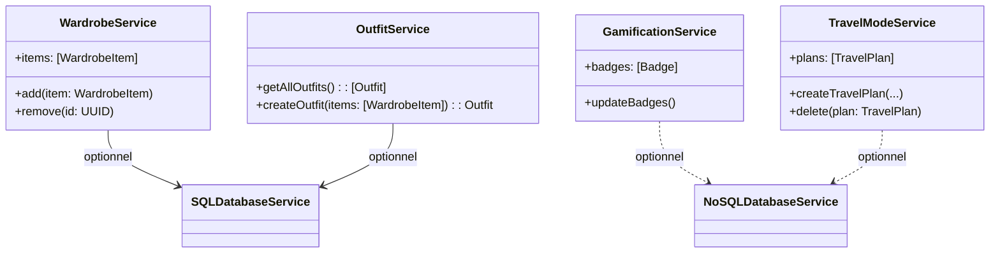
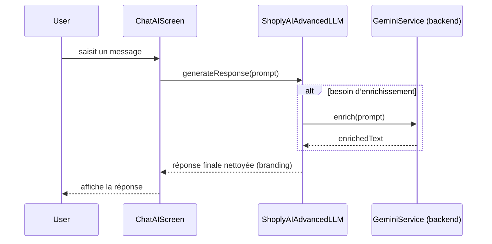

# Diagrammes UML (Mermaid)

## Diagramme de classes (extrait)

```mermaid
classDiagram
    class WardrobeService {
      +items: [WardrobeItem]
      +add(item: WardrobeItem)
      +remove(id: UUID)
    }
    class OutfitService {
      +getAllOutfits(): [Outfit]
      +createOutfit(items: [WardrobeItem]): Outfit
    }
    class GamificationService {
      +badges: [Badge]
      +updateBadges()
    }
    class TravelModeService {
      +plans: [TravelPlan]
      +createTravelPlan(...)
      +delete(plan: TravelPlan)
    }
    class SQLDatabaseService
    class NoSQLDatabaseService

    WardrobeService --> SQLDatabaseService : optionnel
    OutfitService --> SQLDatabaseService : optionnel
    GamificationService ..> NoSQLDatabaseService : optionnel
    TravelModeService ..> NoSQLDatabaseService : optionnel
```

## Diagramme de séquence (flux Chat IA simplifié)

```mermaid
sequenceDiagram
  participant U as User
  participant V as ChatAIScreen
  participant L as ShoplyAIAdvancedLLM
  participant G as GeminiService (backend)

  U->>V: saisit un message
  V->>L: generateResponse(prompt)
  alt besoin d’enrichissement
    L->>G: enrich(prompt)
    G-->>L: enrichedText
  end
  L-->>V: réponse finale nettoyée (branding)
  V-->>U: affiche la réponse
```

